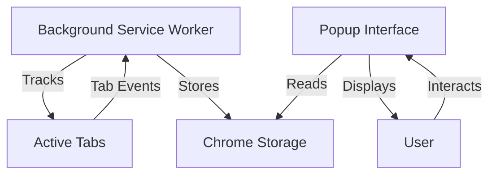

# Simple Web History Tracker Extension

A lightweight and elegant Chrome extension that tracks your browsing history with accurate time tracking. Built with modern web technologies and featuring a beautiful dark-mode interface.


## 📋 Table of Contents

- [Overview](#overview)
- [Features](#features)
- [How It Works](#how-it-works)
- [Installation](#installation)
- [Usage](#usage)
- [Project Structure](#project-structure)
- [Technical Details](#technical-details)
- [Development](#development)
- [Contributing](#contributing)
- [License](#license)

## 🌟 Overview

Simple Web History Tracker is a Chrome browser extension that monitors your web browsing activity and provides detailed insights into the time you spend on different websites. Unlike Chrome's built-in history, this extension tracks the actual time spent on each page and presents it in an intuitive, modern interface.

## ✨ Features

### Core Functionality

- **⏱️ Accurate Time Tracking**: Tracks time spent on each website with precision using a heartbeat mechanism
- **📊 Real-time Updates**: Continuously monitors active tabs and updates time spent automatically
- **🔄 Smart Merging**: Automatically merges consecutive visits to the same URL for cleaner history
- **💾 Persistent Storage**: Saves up to 100 most recent history entries locally

### User Interface

- **🎨 Modern Dark Mode Design**: Beautiful glassmorphism UI with smooth animations
- **📱 Responsive Layout**: Clean, organized display of browsing history
- **🔍 Detailed Information**: Shows page title, URL, time spent, and visit timestamp
- **✨ Smooth Transitions**: Hover effects and micro-animations for enhanced UX

### History Management

- **🗑️ Individual Delete**: Remove specific history entries with a single click
- **🧹 Clear All**: Bulk delete all history with confirmation prompt
- **📋 Copy Links**: Quick copy-to-clipboard functionality for URLs
- **🔗 Quick Access**: Click any history item to open the website in a new tab

### Visual Feedback

- **🎯 Toast Notifications**: Elegant toast messages for user actions
- **📭 Empty State**: Informative display when no history is available
- **🎭 Interactive Elements**: Visual feedback on hover and click interactions

## 🔧 How It Works

### Architecture Overview

The extension consists of three main components working together:



### 1. Background Service Worker (`background.js`)

The background service worker is the heart of the extension, running continuously to track browsing activity.

#### Key Mechanisms:

**Tab Event Listeners:**

- Monitors `chrome.tabs.onActivated` - Detects when you switch tabs
- Monitors `chrome.tabs.onUpdated` - Detects when a page loads or refreshes

**Heartbeat System:**

- Runs every 10 seconds (configurable via `chrome.alarms`)
- Periodically saves progress to prevent data loss
- Ensures accurate tracking even for long browsing sessions

**State Management:**

```javascript
{
  currentTabId: number,    // ID of the currently active tab
  startTime: timestamp,    // When tracking started for current tab
  currentUrl: string       // URL being tracked
}
```

**Smart Record Merging:**

- If you return to the same URL, time is added to the existing record
- Prevents duplicate entries for the same website
- Updates the timestamp to reflect the most recent visit

**Data Flow:**

1. User switches to a new tab
2. Extension saves time for the previous tab
3. Extension starts tracking the new tab
4. Every 10 seconds, progress is saved
5. When switching again, the cycle repeats

### 2. Popup Interface (`popup.html`, `popup.js`, `popup.css`)

The popup provides a beautiful, interactive interface to view and manage your browsing history.

#### Components:

**Header Section:**

- Extension title with gradient styling
- "Clear All" button for bulk deletion

**History List:**

- Displays up to 100 most recent entries
- Each item shows:
  - Page title (truncated if too long)
  - Full URL (truncated with ellipsis)
  - Time spent (formatted as minutes/seconds)
  - Visit timestamp
  - Action buttons (Copy, Delete)

**Empty State:**

- Displays when no history is available
- Shows an informative icon and message

#### User Interactions:

**Click on History Item:**

- Opens the website in a new tab
- Allows quick access to previously visited pages

**Copy Button:**

- Copies the URL to clipboard
- Shows a toast notification confirming the action

**Delete Button:**

- Removes the specific history entry
- Immediately updates the display

**Clear All Button:**

- Shows a confirmation dialog
- Clears all history if confirmed

### 3. Data Storage

**Storage Method:** Chrome's local storage API (`chrome.storage.local`)

**Data Structure:**

```javascript
{
  history: [
    {
      title: "Page Title",
      url: "https://example.com",
      timeSpent: 120,           // in seconds
      visitedAt: "12/25/2025, 6:30:00 AM"
    },
    // ... more entries
  ],
  currentTabId: 12345,
  startTime: 1735089000000,
  currentUrl: "https://example.com"
}
```

**Storage Limits:**

- Maximum 100 history entries stored
- Older entries are automatically removed when limit is reached
- State data (currentTabId, startTime, currentUrl) persists across browser sessions

### Time Tracking Algorithm

```
1. User opens/switches to Tab A at time T1
2. Extension records: { tabId: A, startTime: T1, url: URL_A }

3. Every 10 seconds (heartbeat):
   - Calculate elapsed time: T_current - T1
   - Save/update record for URL_A with accumulated time
   - Reset startTime to T_current

4. User switches to Tab B at time T2:
   - Calculate final time for Tab A: T2 - T1
   - Save/update record for URL_A
   - Start tracking Tab B: { tabId: B, startTime: T2, url: URL_B }

5. If user returns to URL_A later:
   - Find existing record for URL_A
   - Add new time to existing timeSpent
   - Update visitedAt timestamp
```

### Filtering Logic

**Ignored URLs:**

- Chrome internal pages (`chrome://`)
- Very short durations (< 1 second)
- Tabs without valid URLs

**Merged Records:**

- Consecutive visits to the same URL are merged
- Time is accumulated in a single record
- Most recent visit timestamp is preserved

## 📥 Installation

### Method 1: Load Unpacked Extension (For Development/Testing)

1. **Download the Extension**

   ```bash
   git clone https://github.com/RashedulHaqueRasel1/web-history-tracker
   cd web-history-tracker
   ```

2. **Open Chrome Extensions Page**

   - Open Google Chrome
   - Navigate to `chrome://extensions/`
   - Or click Menu (⋮) → More Tools → Extensions

3. **Enable Developer Mode**

   - Toggle the "Developer mode" switch in the top-right corner

4. **Load the Extension**

   - Click "Load unpacked"
   - Navigate to the `web-history-tracker` folder
   - Select the folder and click "Select Folder"

5. **Verify Installation**
   - The extension should appear in your extensions list
   - You should see the extension icon in your Chrome toolbar
   - Click the icon to open the popup interface

### Method 2: Install from Chrome Web Store (Coming Soon)

Once published, you'll be able to install directly from the Chrome Web Store.

## 🚀 Usage

### Getting Started

1. **Install the Extension**

   - Follow the installation steps above

2. **Start Browsing**

   - The extension automatically starts tracking when you browse
   - No configuration needed - it works out of the box

3. **View Your History**
   - Click the extension icon in your toolbar
   - See a list of recently visited websites
   - View time spent on each site

### Managing Your History

#### View Details

- **Page Title**: The title of the webpage
- **URL**: The full web address
- **Time Spent**: Formatted as minutes and seconds (e.g., "5m 30s")
- **Visit Time**: When you last visited the page

#### Copy a Link

1. Hover over a history item
2. Click the copy icon (📋) in the top-right
3. The URL is copied to your clipboard
4. A toast notification confirms the action

#### Delete a Single Entry

1. Hover over the history item you want to remove
2. Click the delete icon (🗑️) in the top-right
3. The entry is immediately removed

#### Clear All History

1. Click the "Clear All" button in the header
2. Confirm the action in the dialog
3. All history is permanently deleted

#### Open a Website

1. Click anywhere on a history item
2. The website opens in a new tab

### Understanding Time Tracking

**How Time is Calculated:**

- Time starts when you focus on a tab
- Time stops when you switch to another tab or close the tab
- Time is saved every 10 seconds to prevent data loss
- If you return to the same URL, time is added to the existing record

**What Counts as "Time Spent":**

- ✅ Active tab with focus
- ✅ Reading, scrolling, interacting
- ❌ Tab in background (not counted)
- ❌ Browser minimized (not counted)

**Accuracy:**

- Updates every 10 seconds
- Minimum tracked duration: 1 second
- Maximum stored entries: 100

## 📁 Project Structure

```
web-history-tracker/
├── manifest.json          # Extension configuration and permissions
├── background.js          # Service worker for tracking logic
├── popup.html            # Popup interface structure
├── popup.js              # Popup interface logic
├── popup.css             # Popup styling and animations
└── README.md             # This file
```

### File Descriptions

#### `manifest.json`

- **Purpose**: Extension configuration file
- **Key Settings**:
  - Manifest version 3 (latest Chrome extension standard)
  - Required permissions: `tabs`, `storage`, `alarms`
  - Service worker registration
  - Popup configuration

#### `background.js`

- **Purpose**: Background service worker
- **Responsibilities**:
  - Tab event monitoring
  - Time tracking logic
  - Data persistence
  - Heartbeat mechanism
- **Key Functions**:
  - `getState()`: Retrieves current tracking state
  - `saveState()`: Saves tracking state to storage
  - `saveOrUpdateRecord()`: Creates or updates history records

#### `popup.html`

- **Purpose**: Popup interface structure
- **Components**:
  - Header with title and clear button
  - History list container
  - Empty state display
  - Script and style references

#### `popup.js`

- **Purpose**: Popup interface logic
- **Key Functions**:
  - `renderHistory()`: Displays history entries
  - `formatTime()`: Formats seconds to readable time
  - `copyToClipboard()`: Copies URL to clipboard
  - `deleteItem()`: Removes a single history entry
  - `showToast()`: Displays notification messages

#### `popup.css`

- **Purpose**: Popup styling
- **Features**:
  - CSS custom properties for theming
  - Glassmorphism effects
  - Smooth animations and transitions
  - Responsive layout
  - Custom scrollbar styling

## 🔬 Technical Details

### Technologies Used

- **Manifest Version**: V3 (latest Chrome extension standard)
- **JavaScript**: ES6+ (async/await, arrow functions, template literals)
- **CSS**: Modern CSS with custom properties, animations, and glassmorphism
- **APIs Used**:
  - Chrome Tabs API
  - Chrome Storage API
  - Chrome Alarms API
  - Clipboard API

### Browser Compatibility

- ✅ Google Chrome (version 88+)
- ✅ Microsoft Edge (Chromium-based)
- ✅ Brave Browser
- ✅ Other Chromium-based browsers

### Performance Considerations

**Memory Usage:**

- Minimal background memory footprint
- Storage limited to 100 entries
- Efficient data structures

**CPU Usage:**

- Heartbeat runs every 10 seconds (low frequency)
- Event-driven architecture (no polling)
- Optimized DOM manipulation in popup

**Storage:**

- Uses Chrome's local storage (efficient and fast)
- Automatic cleanup of old entries
- No external server dependencies

### Security & Privacy

**Data Privacy:**

- ✅ All data stored locally on your device
- ✅ No data sent to external servers
- ✅ No tracking or analytics
- ✅ No personal information collected

**Permissions Explained:**

- `tabs`: Required to monitor tab activity and get page titles/URLs
- `storage`: Required to save browsing history locally
- `alarms`: Required for the heartbeat mechanism

## 💻 Development

### Prerequisites

- Google Chrome browser (version 88 or higher)
- Basic knowledge of JavaScript, HTML, and CSS
- Text editor or IDE (VS Code recommended)

### Setting Up Development Environment

1. **Clone the Repository**

   ```bash
   git clone https://github.com/RashedulHaqueRasel1/web-history-tracker
   cd web-history-tracker
   ```

2. **Open in Your Editor**

   ```bash
   code .  # For VS Code
   ```

3. **Load in Chrome**
   - Follow the installation steps in the [Installation](#installation) section
   - Enable "Developer mode" in `chrome://extensions/`
   - Load the extension as unpacked

### Making Changes

1. **Edit Files**

   - Modify `background.js` for tracking logic changes
   - Modify `popup.js` for UI logic changes
   - Modify `popup.css` for styling changes
   - Modify `popup.html` for structure changes

2. **Reload Extension**

   - Go to `chrome://extensions/`
   - Click the reload icon (🔄) on your extension card
   - Or use the keyboard shortcut: `Ctrl+R` (Windows/Linux) or `Cmd+R` (Mac)

3. **Test Changes**
   - Click the extension icon to open the popup
   - Browse some websites to test tracking
   - Check the console for errors (F12 → Console)

### Debugging

**Background Service Worker:**

```bash
1. Go to chrome://extensions/
2. Find your extension
3. Click "service worker" link
4. DevTools will open for the background script
```

**Popup Interface:**

```bash
1. Right-click on the extension popup
2. Select "Inspect"
3. DevTools will open for the popup
```

**View Storage:**

```bash
1. Open DevTools for popup or background
2. Go to Application tab
3. Navigate to Storage → Local Storage
4. Find your extension's storage
```

### Customization Ideas

**Change Heartbeat Frequency:**

```javascript
// In background.js, line 2
chrome.alarms.create("heartbeat", { periodInMinutes: 0.167 }); // 10 seconds
// Change to 30 seconds:
chrome.alarms.create("heartbeat", { periodInMinutes: 0.5 });
```

**Change Maximum History Entries:**

```javascript
// In background.js, line 105
if (history.length > 100) history = history.slice(0, 100);
// Change to 200:
if (history.length > 200) history = history.slice(0, 200);
```

**Change Color Scheme:**

```css
/* In popup.css, modify CSS variables */
:root {
  --bg-color: #0f172a; /* Background color */
  --accent-color: #818cf8; /* Primary accent */
  --danger-color: #f43f5e; /* Delete button color */
}
```

**Add Export Functionality:**

```javascript
// Add to popup.js
function exportHistory() {
  chrome.storage.local.get(["history"], (res) => {
    const dataStr = JSON.stringify(res.history, null, 2);
    const blob = new Blob([dataStr], { type: "application/json" });
    const url = URL.createObjectURL(blob);
    const a = document.createElement("a");
    a.href = url;
    a.download = "history.json";
    a.click();
  });
}
```

## 🤝 Contributing

Contributions are welcome! Here's how you can help:

### Reporting Bugs

1. Check if the bug has already been reported in [Issues](https://github.com/RashedulHaqueRasel1/web-history-tracker/issues)
2. If not, create a new issue with:
   - Clear description of the bug
   - Steps to reproduce
   - Expected vs actual behavior
   - Screenshots if applicable
   - Browser version and OS

### Suggesting Features

1. Check existing [Issues](https://github.com/RashedulHaqueRasel1/web-history-tracker/issues) for similar suggestions
2. Create a new issue with:
   - Clear description of the feature
   - Use case and benefits
   - Possible implementation approach

### Submitting Pull Requests

1. Fork the repository
2. Create a new branch (`git checkout -b feature/amazing-feature`)
3. Make your changes
4. Test thoroughly
5. Commit your changes (`git commit -m 'Add amazing feature'`)
6. Push to the branch (`git push origin feature/amazing-feature`)
7. Open a Pull Request

### Code Style Guidelines

- Use ES6+ JavaScript features
- Follow existing code formatting
- Add comments for complex logic
- Keep functions small and focused
- Use meaningful variable names

## 🧑‍💻 Author

**Rashedul Haque Rasel**

📧 Email: [rashedulhaquerasel1@gmail.com](mailto:rashedulhaquerasel1@gmail.com)

🌐 Portfolio: [https://rashedul-haque-rasel.vercel.app](https://rashedul-haque-rasel.vercel.app)

💼 LinkedIn: [https://www.linkedin.com/in/rashedul-haque-rasel](https://www.linkedin.com/in/rashedul-haque-rasel)
